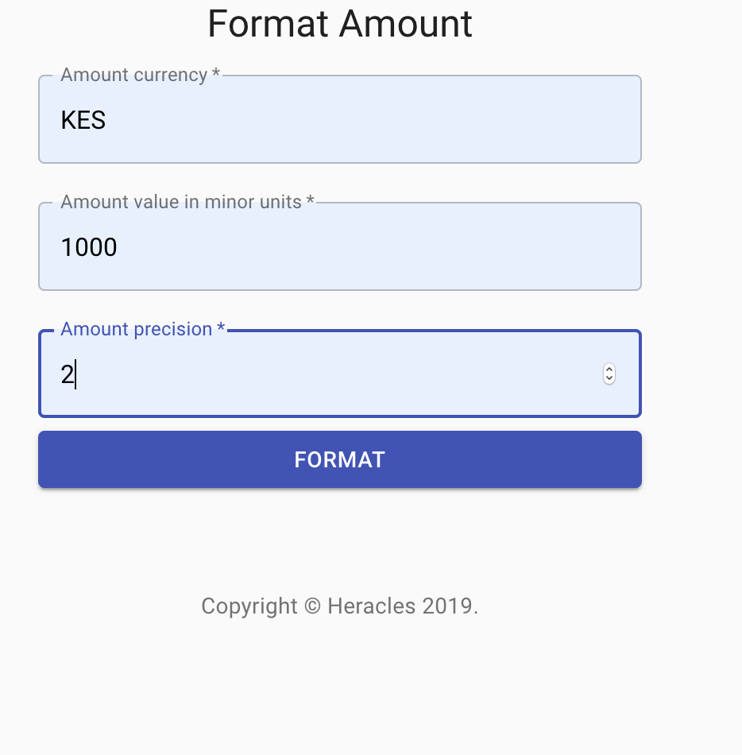

**Heracles**
[](https://circleci.com/gh/kwahome/heracles)
[](https://codeclimate.com/github/kwahome/heracles/maintainability)



Heracles is a web app exposing an API that takes in user amount input and converts into a string format.
It's fronted by a UI that captures the inputs from the user and submits to the backend.

A swagger contract documenting the v1 API can be found at:

```heracles-api/definitions/api/v1/format_amount_1.yml```

**API design**

Below is an example API request body:

```json
{
	"header": {
		"messageId": "c1a2c8c7-0465-4ec1-a8fb-3a1b58922548",
		"timestamp": "2019-11-07T19:36:14.049467Z"
	},
	"amount": {
		"currency": "KES",
		"value": 100000,
		"precision": 2
	},
	"locale": "en",
	"decimalPlaces": 2,
	"thousandsSeparator": ",",
	"decimalSeparator": "."
}
```

For purposes of internationalization, an `Amount` object is used to represent money. It bears three fields:
- `currency` - the currency
- `value` - the amount of money that is in minor currency units
- `precision` - the conversion precision for use in converting minor to major units

`locale` is an optional field that can be passed in to customize how money is formatted. A supplied locale is checked
against known locales and if found, a number format is derived from it. `decimalPlaces` represents the rounding off
precision that applies, `thousandsSeparator` is the grouping separator character while `decimalSeparator` is the
character used to separate decimals. They are all optional with defaults used if not supplied.

An example success response from this API:

```json
{
    "header": {
        "messageId": "6427d576-5038-4aaa-a02d-dedf9e636b96",
        "timestamp": "2019-11-20T12:53:52.665058Z",
        "responseStatus": {
            "status": "SUCCESS"
        },
        "groupId": "c1a2c8c7-0465-4ec1-a8fb-3a1b58922548"
    },
    "formattedAmount": "KES 1,000.00"
}
```

**Tech stack**
- Programming language : Kotlin
- Framework : Spring Boot
- Continuous Integration pipeline : CircleCI
- Static analysis tool : Code Climate
- Linting : kotlinter (Kotlin), eslint (Typescript, React)
- Unit tests : JUnit (backend), jest(frontend)
- Integration tests : JUnit
- UI tests : Selenium WebDriver
- API documentation : Swagger


**Type of tests**
1. **Unit tests** - testing the smallest testable part of both the backend and front end, these have been added to affirm
correctness of these building blocks. They are meant to be fast as they mock out dependencies.

    `JUnit` is used as the test framework and `mockk` for mocking out and spying on various dependencies for backend
    unit tests while `jest` is used on the front end.
    
    To run these tests use:
    
    ```gradle test``` on the kotlin backend and ```npm run test``` on the react frontend. Make sure to be on the
    correct directory
    
Unit tests form the bulk of tests written here as they are cheap in effort and cover more contained scopes.

2. **Integration tests** - these test the integration and working together of various components. They are more 
expensive to write and are slower to run hence their isolation from unit tests because typically dependencies are not
mocked in these kind of tests as the intention is test workflow scenarios.

    For the backend, these tests are located in an `integration` directory of the test package. Integration tests here
    have been written with the help of SpringBootTest and configuration of random web ports. An improvement here is the
    application of test containers to set up a reusable integration test framework.
    
    To run these tests, use:
    
    ```gradle integrationTest```

3. **Linting** - code is read more than it is written hence its maintainability is paramount. Code quality includes use 
of best practices that are enforced by language specific linters. The have been integrated into both kotlin and 
typescript/react code bases.

    To run these linting, use:
    
    ```gradle check``` on the kotlin backend and ```npm run lint``` on the react frontend. Make sure to be on the
        correct directory
        
 **Build pipeline**
 CircleCI is the build pipeline tool in use.
 Its configuration can be found at `.circleci/config.yml`.
 Tests and checks described above have all been wired up as parallelized jobs on this pipeline for optimized
 performance.
    
**Enhancements**
- Dockerization for dev/staging/test/prod environment parity which ensures that runtimes are similar hence reducing
regression from misconfiguration risks.
- Use of test containers to set up a configurable and reusable integration test framework. Cloud dependencies can be
configured with their respective simulators where applicable
- More types of tests targeting different aspects of the application lifecycle can be added in for a wider coverage. 
Load and performance tests that provide an indication of how the application would perform under load are one such 
example. Another is traffic shadowing which is a release process test.
- Metrics and logging for better observability. Metrics and traces augments testing as it provides the means of 
validating some of the observations being made.
