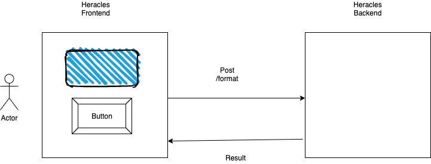

# Heracles - **The Greek Candidate's Solution**
Heracles is next generation currency formatter  which allows user to format the currency in a desired format.
Heracles is split into two parts

[See orignal assignment](#Heracles)

## heracles-backend
Heracles backend is express based server which exposes a REST API to handle the currency formatting.
Technologies used:
1. Typescript
2. Express
3. Jest

## heracles-frontend
Heracles frontend is a HTML app which allows user to enter a currency and format the currency in a desired format.
Technologies used:
1. Typescript
2. Webpack

## Architecture diagram


As part of this solution I decided to split it into 2 parts , the backend and the frontend part.
Separating this would help us to develop many clients against a single backend .

## Heracles Backend

The backend exposes a REST API which clients can use to build the currency formatter. The REST API accepts
param input which needs to be a number and then it returns the result in the desired format.

Testing Covered:
1. Unit Tests -- These tests are written in jest.
2. Integration Tests -- These tests are written using supertest and jest , these spin up an in memory express server
   and check the contract of the REST API.
3. Mutation Tests -- These tests checks the validity of the unit tests and their coverage. These are written using Stryker.
4. Performance Tests/Load Tests -- These tests are written using k6 tool which allows us to write tests in typescript/javascript.

## Heracles Frontend

The frontend is a simple HTML application which consumes the heracles backend and allows users to format the users
to format the currency in a desired format.

Testing Covered:
1. Unit Tests -- These tests are written using jest.
2. E2E Tests -- These tests are written using webdriverio and use mocha as a test runner. I have chosen not to use cucumber
to make it more developer friendly and reduce the code complexity. These tests check the user experience and also edge cases
like server going down , request aborted etc.  Currently these tests are run only chrome but can easily be extended to other browsers
easily.
3. Mutation Tests -- These tests check the validity of the unit tests.

## Nice to have
Currently, there are things that could have been implemented and not implemented in terms of testing

1. Contract Testing -- To verify the contract between heracles frontend and heracles backend, this can be quite beneficial as the complexity of the application grows, and it will also help teams to get rid of expensive end to end tests.
2. Frontend performance Testing -- To check the performance of the front end application , currently it is a pretty straight forward
application so maybe it does not add much value. But going ahead as the application might grow it would be beneficial to measure
   frontend performance using lighthouse, sitespeed etc.

<br>

---

<br>

# Heracles - **Original assignment**


We're really happy that you're considering to join us! Here's a challenge that will help us understand your skills and serve as a starting discussion point for the interview.

We're not expecting that everything will be done perfectly as we value your time. You're encouraged to point out possible improvements in your solution and we will discuss them during the interview.

## The challenge: Money Formatting

Given an amount of money as a number, format it as a string. Add associated tests for the functionality and for the user interface.

```js
formatMoney(2310000.159897); // '2 310 000.16'
formatMoney(1600); // '1 600.00'
```

This needs to be a "fully working application" (you choose the format: web, cli, backend-frontend, mobile app, ...)

*eg: A simple HTML page with an input box*

## Our evaluation criteria:

- How did your structure your code? (*eg: is it structured in a testable way?*)
- What did you test? (*eg: functionality, performance, etc.*) at which level? (*eg: unit, integration, UI, etc.*)
- Which testing technique did you use? why?
- We also care a little about the functionality itself

## What we won't really care:

- If your UI looking great, 0 line of CSS is quite enough CSS
- You use the latest JS framework of the day
- The programming language (We write a lot of Kotlin & Typescript at Pleo, just in case you want to show off your skills!)

## What would be awesome:

- You use some nice testing techniques, fuzz testing, mutation testing, ... (even if they don't make sense here they'll probably do in your day to day job)
- You handle some stuff to test that we are not even aware of
  - *eg: You handle funky unicode strings (eg: [big list of naughty strings](https://github.com/minimaxir/big-list-of-naughty-strings))*
- You show us how you run your tests in CI/CD

## Instructions:

When you're ready to work on the challenge, clone (and not fork) the repo. We want to see your progression through commits (don’t commit the entire solution in 1 step) and don't forget to create a `README.md` to explain your thought process and also provide instructions on how to run the tests.

When you're ready to submit your challenge, share the link to your repo with us. If you prefer to keep it private, we will provide you with some emails to invite to the repo.

Please let us know how long the challenge takes you. We're not looking for how speedy or lengthy you are. It's just really to give us a clearer idea of what you've produced in the time you decided to take. Feel free to go as big or as small as you want.

Happy testing! 🚀
