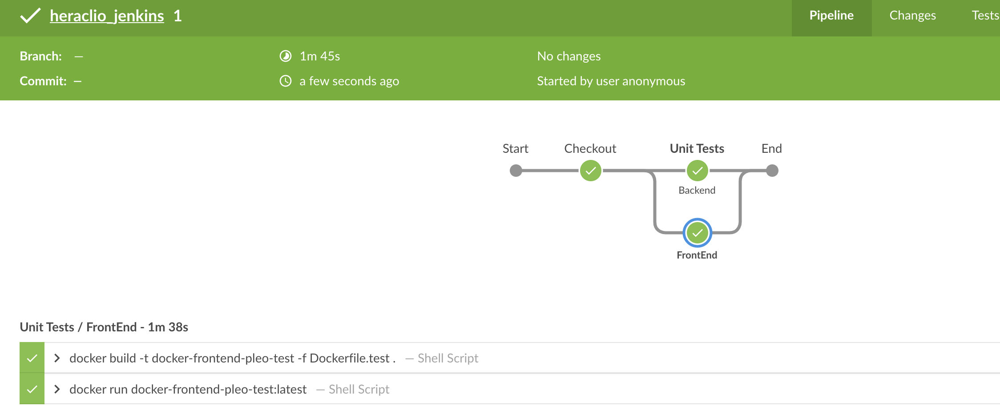
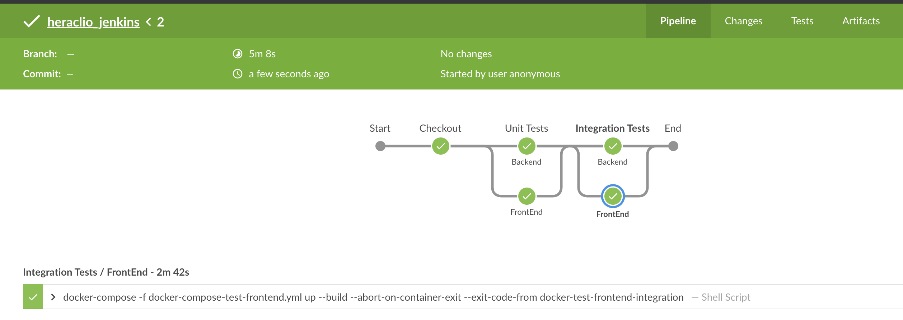
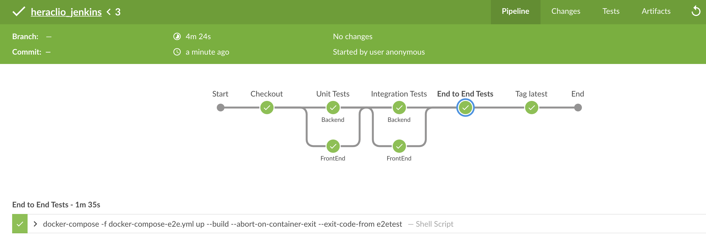

Pleo Challenge CI
=================

Technology used:
- Jenkins
- scripted pipeline
  
Here a very basic CI strategy

- With every push into a feature branch, all the unit tests must be run

- With a new pull request, we must run Unit + Integration Tests

- After Merge in master, we must run Unit, Integration and End2End tests. In addition, tag `latest` must be applied. (No code provided)

