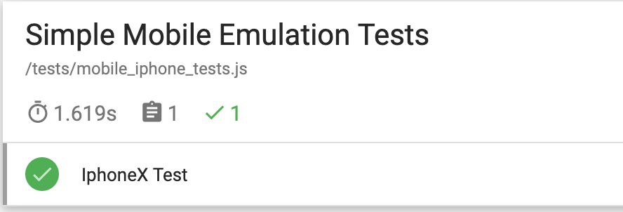
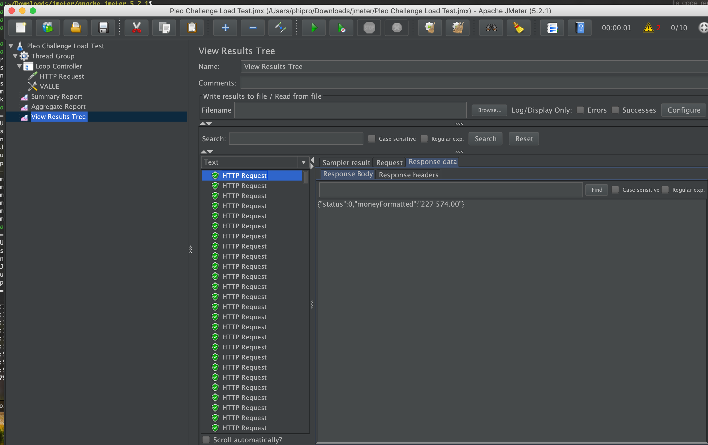
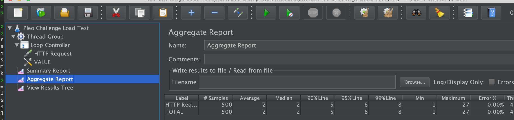
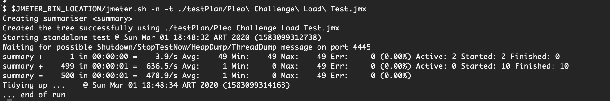
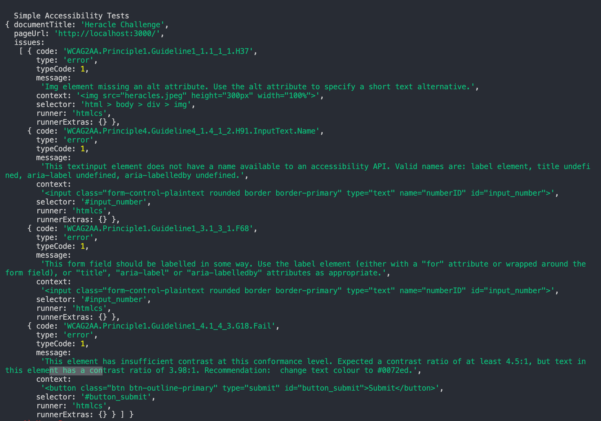
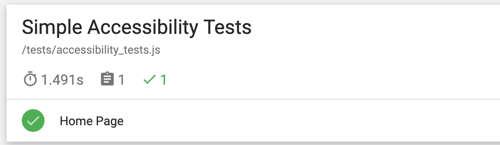

Pleo Challenge - Extra Tests
========================================

Mobile
------
Simple puppeteer tests that emulates iphoneX
Technology used:
- nodejs
- puppeteer
- mocha
- yarn

Prerq:
- node10
- yarn 1.21
  
Run with
```
yarn install
yarn mocha
```
Results will be in `./more_tests/mobile/mochawesome-report/mochawesome.html`




Load
----
Test plan to generate small load against the server
Technology used:
- jmeter

Run with (with java8 and jmeter installed)
- Open jameter
- Open test plan
- Run it





From command line run
```
jmeter -n -t <TESTPLAN>
```




Accessibiliby
------------
Accesibility issues in home page.
Technology used:
- nodejs
- puppeteer
- mocha
- yarn
- pa11y

Prerq:
- node10
- yarn 1.21

Run with 
```
yarn install
yarn mocha
```
After solved some issues



Results should be like the one in `./more_tests/accessibility/mochawesome-report/mochawesome.html`



